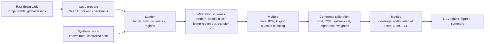
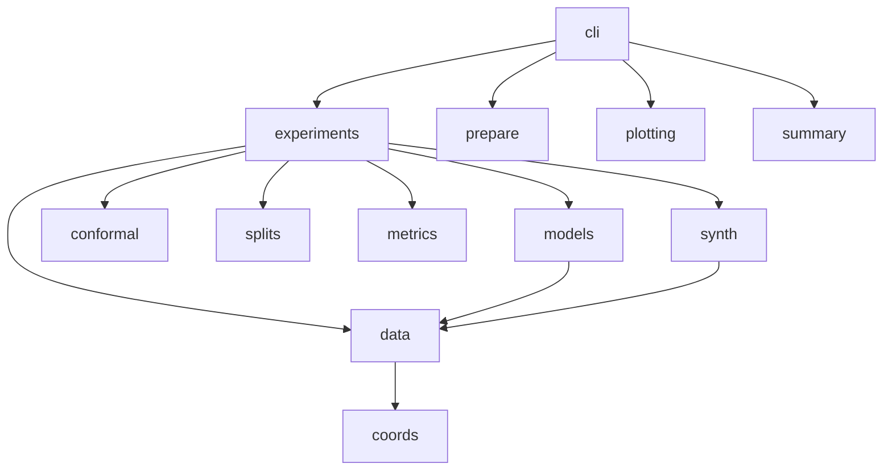

# Architecture

## Data and computation flow

```mermaid
flowchart LR
    RAW["Raw downloads<br/>Punjab wells, global arsenic"] --> PREP["wqub prepare<br/>clean CSVs and checksums"]
    PREP --> LOAD["Loader<br/>target, limit, covariates, regions"]
    SYN["Synthetic world<br/>known truth, controlled shift"] --> LOAD
    LOAD --> SPLIT["Validation schemes<br/>random, spatial block, leave-region-out, transfer box"]
    SPLIT --> FIT["Models<br/>naive, IDW, kriging, quantile boosting"]
    FIT --> CAL["Conformal calibration<br/>split, CQR, spatial-local, importance-weighted"]
    CAL --> MET["Metrics<br/>coverage, width, interval score, Brier, ECE"]
    MET --> OUT["CSV tables, figures, summary"]
```

## Module dependencies (`src/wqub/`)

```mermaid
flowchart TD
    cli --> experiments
    cli --> prepare
    cli --> plotting
    cli --> summary
    experiments --> models
    experiments --> conformal
    experiments --> splits
    experiments --> metrics
    experiments --> data
    experiments --> synth
    models --> data
    synth --> data
    data --> coords
```
